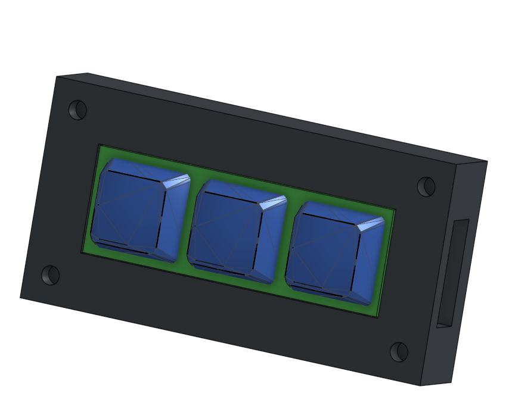
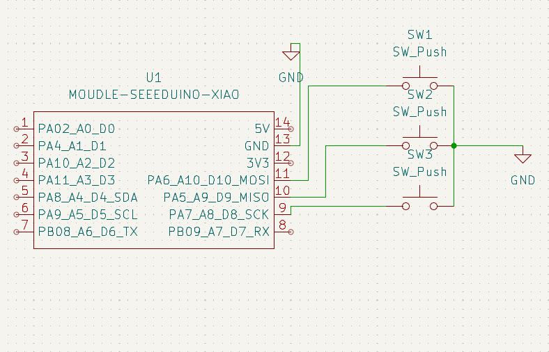
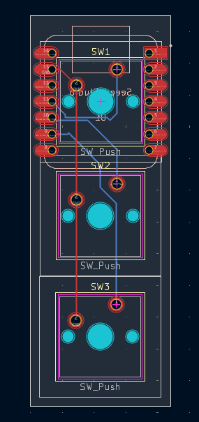
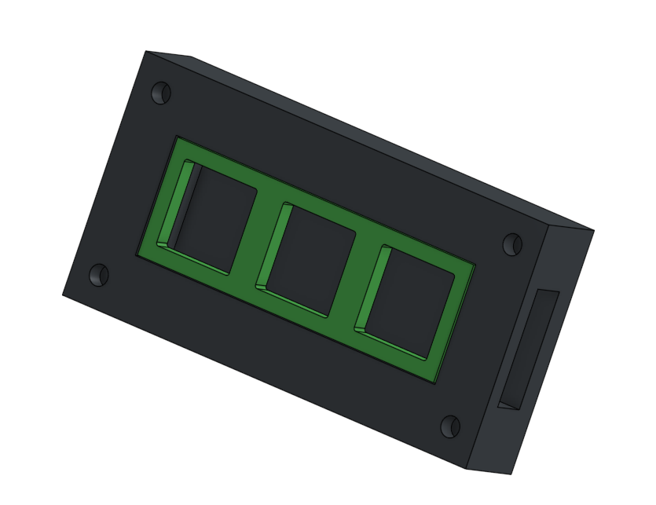

# amogh-macropad

Hi, I'm Amogh and this is my macropad! More like MacroCAD, since it lets you copy, paste, and undo on the fly. I called it the DinoPad because it's simple and good for getting to business, like in the good old days...

## At a Glance
### Render of Macropad

### Schematic Diagram

### PCB Layout

### 3D Case

## Bill of Materials
| Component | Quantity Used | Source | Purpose |
| :--- | :---: | :--- | :--- |
| **Seeed Studio XIAO RP2040** | 1 | Seeed XIAO RP2040 (1) | Main microcontroller |
| **Mechanical Switches** | 3 | MX-style switches (16) | Input keys |
| **Keycaps** | 3 | Blank DSA keycaps (16) | Keycaps |
| **Diodes** | 3 | 1N4148 diodes (20) | Prevent ghosting |
| **Case Screws** | 4 | M3×16mm screws (6) | Secure top plate |
| **Heatset Inserts** | 4 | M3×5×4mm inserts (6) | Mount to case |
| **Custom PCB** | 1 | JLCPCB | Main logic board |
| **3D Printed Top Plate** | 1 | Printing Legion | Switch mounting |
| **3D Printed Bottom Case** | 1 | Printing Legion | Housing |
